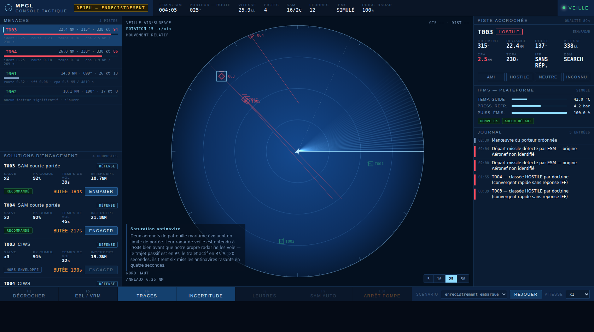
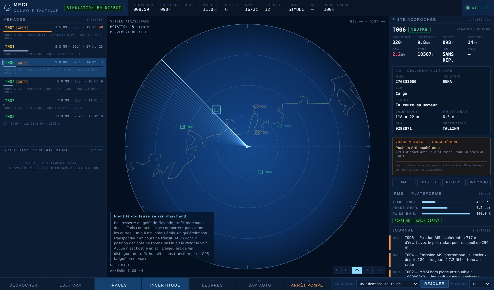
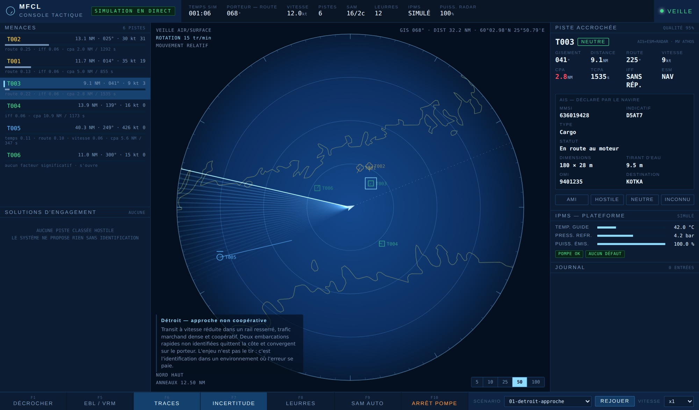
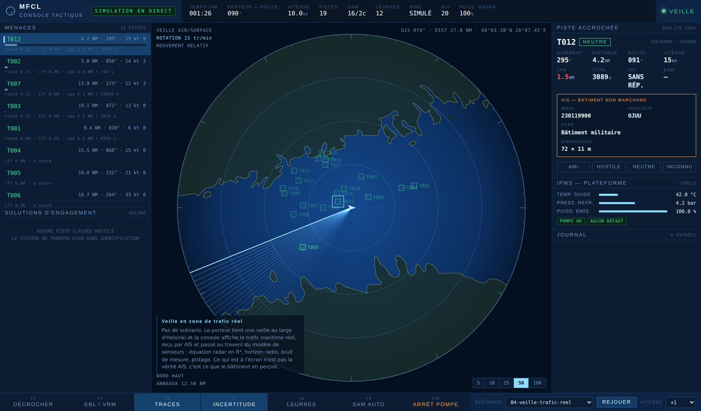

# CMS-Lab — simulateur de système de gestion de combat naval

Un lab autonome qui simule un bâtiment de surface, sa veille radar, son
pistage, son évaluation de menace et ses solutions d'engagement — et qui
couple le tout à un automate industriel pour la conduite de la plateforme.



Le parti pris central, emprunté aux modèles de CMS utilisés en analyse
opérationnelle : **le cœur de simulation ne connaît ni le réseau ni
l'écran.** Il avance d'un pas fixe et rend un instantané. C'est ce qui
permet de le faire tourner à vingt fois la vitesse réelle pour produire des
statistiques, puis de rejouer un run dans la console — avec le même code.

```
sim/  (headless, déterministe, zéro E/S)
  │
  ├─► services/server.py ─ SSE ─► web/  la console d'opérateur
  ├─► tools/record.py    ─────►  un enregistrement JSONL rejouable
  └─► tools/montecarlo.py ────►  N runs, statistiques de doctrine
```

## Démarrer

```bash
docker compose up --build          # puis http://localhost:8000
```

C'est tout. Aucune dépendance tierce : le cœur de simulation, le serveur, le
client Modbus et les capteurs de terrain sont écrits en bibliothèque
standard Python. L'image se construit sans `pip install` et sans réseau.

Sans Docker :

```bash
python3 services/server.py
```

### Avec un vrai automate

```bash
docker compose -f docker-compose.yml -f docker-compose.plc.yml \
  --profile plc up --build
```

Ajoute OpenPLC (interface web sur `:8080`, identifiants `openplc`/`openplc`,
**à changer**) et les capteurs de terrain. Charger `plc/program.st` depuis
l'interface, le compiler, démarrer l'automate.

Si le port 8080 est déjà pris sur la machine hôte (une instance OpenPLC
autonome par exemple), `docker compose` refuse de démarrer avec
`port is already allocated`. Reporter l'interface web sur un autre port
hôte, sans rien changer d'autre :

```bash
OPENPLC_WEB_PORT=8081 docker compose -f docker-compose.yml \
  -f docker-compose.plc.yml --profile plc up --build
```

Si l'automate n'est pas joignable, **rien ne casse** : le pont dégrade, l'IPMS
repasse sur son modèle logiciel et la console affiche `SIMULÉ` au lieu de
`MODBUS`. La stack par défaut est donc utilisable immédiatement.

## Ce qui est modélisé

### Senseurs

Deux lois portent tout le réalisme du domaine.

**L'équation radar en R⁴.** Le rapport signal sur bruit décroît comme la
puissance quatrième de la distance, ce qui crée l'asymétrie qui structure
tout : un missile de 0,09 m² est détecté dix-sept fois plus près qu'une
frégate de 10 000 m². Ce n'est pas un réglage, c'est de la physique.

**L'horizon radio**, `d(NM) ≈ 2,23 (√h_antenne + √h_cible)`. Antenne à 30 m,
missile rasant à 5 m : **17 NM**. À 525 nœuds, cela laisse moins de deux
minutes. Le missile n'approche pas, il *surgit* — et c'est tout le tempo de
la défense antiaérienne navale.

S'y ajoutent l'ESM (trajet passif en R², donc on entend un radar bien avant
de voir la plateforme qui le porte), l'IFF, l'AIS, et un bruit de mesure en
polaire — l'erreur transverse grandit avec la distance, ce qui fait
« frétiller » les pistes lointaines.

**L'AIS est décodé au format de la norme** (UIT-R M.1371) : MMSI, indicatif,
numéro OMI, type de navire, statut de navigation, dimensions hors tout,
tirant d'eau, destination. `sim/ais.py` traduit les codes en libellés, et la
console affiche le tout sous un titre qui dit l'essentiel — *déclaré par le
navire*. Un navire diffuse ce qu'il veut : l'AIS ne prouve rien, il propose
une identité que le radar est libre de contredire.

C'est pour cette raison que **l'absence d'AIS est affichée comme une
information**, et non comme un champ vide. Un mobile de surface qui ne se
déclare pas — transpondeur éteint, hors zone VHF, ou navire non soumis à
obligation — est exactement le contact qui mérite un opérateur. Dans le
scénario du détroit, les deux vedettes sont les seules à ne rien émettre.

### Pistage

Filtre de Kalman à vitesse constante, association au plus proche voisin sous
fenêtre de Mahalanobis, initiation 3 plots sur 5 tours, suppression après 4
tours sans plot, fusion des détections en gisement seul. Écrit à la main en
4×4 ; la matrice d'observation ne retient que la position, donc la covariance
d'innovation est 2×2 et s'inverse en une ligne.

Le bruit de manœuvre s'indexe sur la vitesse estimée. Une valeur unique ne
peut pas servir à la fois un missile et un caboteur : à l'ancien réglage, le
filtre s'autorisait à croire qu'un porte-conteneurs change de vitesse de sept
nœuds à chaque tour d'antenne, suivait donc le bruit de mesure au lieu de le
moyenner, et rendait **une vitesse fausse de moitié sur une position juste**.
C'est le genre de panne qui ne se voit pas à l'écran — mais le TEWA en tire un
temps avant CPA et une butée de tir également faux. La borne haute reste la
valeur historique, donc les scénarios antinavires sont inchangés.

**La console n'affiche jamais la vérité terrain.** Elle affiche le produit du
pistage, avec son ellipse d'incertitude et sa qualité de piste — qui se
dégrade toute seule quand les plots manquent.

### TEWA

L'évaluation de menace produit un score **et le détail de ses facteurs** :
géométrie, temps avant CPA, vitesse, réponse IFF, corrélation ESM,
identification. Un opérateur doit pouvoir contester un classement, donc le
système doit dire pourquoi il classe.

L'affectation d'effecteur produit des **solutions d'engagement**, chacune
portant sa **butée de tir** — l'instant au-delà duquel il est trop tard. C'est
ce compte à rebours qui pilote réellement une console de défense aérienne.
L'ordonnancement tient compte des canaux de conduite de tir, qui sont la
ressource rare : c'est elle qui crée le problème, pas le stock de munitions.

Hors pression de temps, les solutions sont classées par **effet gradué** : le
moyen le plus économique qui fait le travail passe devant. Le système ne
propose pas un missile antinavire contre une vedette à 9 NM.

**Le système propose, l'opérateur dispose.** Rien ne part au tir sans action
explicite, sauf doctrine armée à l'avance — et le journal dit toujours qui a
classé une piste et qui a ouvert le feu.

### Vraisemblance des déclarations



L'AIS est **déclaratif**. Un navire diffuse ce qu'il veut, et éteindre un
transpondeur ne demande qu'un interrupteur. Un système qui gobe l'AIS n'est
pas un système de combat, c'est un afficheur.

`sim/veracite.py` compare donc la déclaration à la mesure :

| Contrôle | Ce qu'il regarde |
| --- | --- |
| Écart de position | La position déclarée tombe-t-elle sur le plot radar, à cinq sigma près de l'ellipse de la piste |
| Écart de cinématique | Le vecteur vitesse déclaré contre le vecteur mesuré — pas la vitesse et le cap séparément |
| Extinction | Un contact tenu au radar, toujours à portée VHF, qui cesse d'émettre |
| Statut contredit | Se déclare au mouillage et fait route à dix nœuds |
| Gabarit incompatible | Deux cents mètres de coque annoncés à quarante nœuds |
| MMSI hors plage | Les trois premiers chiffres sont un indicatif de pays attribué par l'UIT ; 199 n'existe pas |

Un point d'architecture en découle, et il n'est pas cosmétique : **la
corrélation AIS se fait désormais sur la position déclarée**, pas sur la
vérité terrain. C'est la seule position qu'un vrai système reçoit. Une
déclaration qui ne trouve aucun écho radar en face reste orpheline et
s'affiche comme telle — un petit mobile s'entend plus loin qu'il ne se voit,
donc ce n'est pas une anomalie, mais l'opérateur doit le savoir.

Deux principes tiennent tout le reste :

**Une incohérence n'est pas une intention.** Un GPS fatigué et une
dissimulation produisent le même écart, et le système n'a aucun moyen de les
distinguer — il ne doit donc pas prétendre le faire. Le TEWA en fait un
facteur plafonné à 0,16, qui fait remonter un contact dans la liste pour
qu'un opérateur le regarde. Jamais une désignation.

**Mais une déclaration douteuse cesse de valoir classement.** La corrélation
AIS classait automatiquement en neutre ; elle ne le fait plus quand la
déclaration est incohérente. Un fraudeur n'obtient pas gratuitement le statut
que sa fraude vise.

Les seuils sont **mesurés, pas choisis** : 351 000 relevés de position et
234 000 de cinématique sur du trafic honnête. À trois sigma, le contrôle de
position produisait huit cents fausses alarmes ; à cinq, aucune. C'est ce qui
décide, parce qu'une fausse alarme coûte plus cher qu'une détection manquée —
elle reste au journal quand elle s'efface, et elle apprend à l'opérateur à
ignorer l'indicateur.

### Position géographique



Le cœur travaille en mètres dans un plan tangent local, et n'a jamais vu un
degré de latitude. `sim/geo.Projection` fait la conversion à l'entrée et à la
sortie, avec les vrais rayons de courbure de l'ellipsoïde au point de
référence : sur une centaine de milles, l'écart avec un rayon sphérique moyen
dépasse largement une ellipse d'incertitude.

Un scénario s'ancre sur la carte avec un bloc `[origine]`. Sans lui il reste
purement relatif, et la console n'affiche simplement pas de position — aucun
scénario écrit avant l'ancrage ne casse.

```toml
[origine]
lat = 59.85
lon = 24.85
```

Le fond de carte est du Natural Earth 10 m découpé pour la zone
d'opérations, en deux couches : le trait de côte pour le dessin, et les
polygones de terre pour le remplissage. Les deux sont nécessaires — un trait
seul ne dit pas de quel côté est la mer, et sur un scope dense c'est
illisible. La terre est **réelle mais toujours transparente** : le radar voit
à travers.

```bash
curl -O https://raw.githubusercontent.com/nvkelso/natural-earth-vector/master/geojson/ne_10m_coastline.geojson
curl -O https://raw.githubusercontent.com/nvkelso/natural-earth-vector/master/geojson/ne_10m_land.geojson
python3 tools/coastline.py ne_10m_coastline.geojson --terres ne_10m_land.geojson \
    --lat 59.85 --lon 24.85 --rayon 120 -o web/coastline.json
```

Les polygones servent aussi à vérifier qu'un scénario est posé où il doit
l'être. Ce n'est pas de la coquetterie : l'origine décide de l'eau libre
autour du porteur et de la zone où l'ingestion AIS va chercher du trafic.
Deux scénarios avaient été écrits à deux milles et demi d'un port, au milieu
des skerries — ça se voit tout de suite à l'écran, et personne ne l'avait
relevé parce que l'œil ne distingue pas « au large » de « dans les cailloux »
sur un scope à cinquante milles.

```bash
python3 tools/eaux.py                                       # origines et contacts
python3 tools/eaux.py --capture fixtures/ais-golfe-finlande.json
```

Le contrôle couvre l'origine de chaque scénario, **la position de chaque
contact de surface, et sa route** : un contact correctement posé au départ ne
prouve rien, puisqu'à quatorze nœuds pendant un quart d'heure il parcourt
trois milles et demi. `--capture` inspecte un instantané AIS et dit lesquels
de ses navires la carte place à terre, en distinguant ceux que le pont écarte
de ceux qui resteraient affichés.

Limite connue : Natural Earth 10 m ne porte pas les petits îlots. Le contrôle
attrape la faute grossière, pas la subtile.

### Trafic maritime réel



`services/ais.py` va chercher des messages AIS et en fabrique des `Contact`.
Une fois entrés dans le monde, ces navires sont **indiscernables de ceux
qu'un scénario écrit à la main** : même équation radar, même horizon, même
pistage. La physique déjà écrite devient un filtre sur du trafic réel.

```bash
python3 services/server.py                          # puis choisir 04 dans le menu
AIS_SOURCE=digitraffic python3 services/server.py   # flux public réel
python3 services/ais.py --capture mon-instantane.json
```

**Trois sources, et la console dit laquelle est en service** — la question
« est-ce que c'est du réel ? » se pose immédiatement, et une réponse cachée
n'en est pas une. Le bandeau affiche `RÉEL` en vert, `capture` ou
`synthétique` en ambre.

| Source | D'où ça vient | Comment |
| --- | --- | --- |
| `synthétique` | L'instantané livré avec le dépôt, écrit à la main. Plausible, mais inventé — c'est **le défaut**, pour que le lab tourne sans réseau | rien à faire |
| `capture` | Un instantané réel que vous avez capturé, rejoué hors ligne | touche `F2`, ou `python3 services/ais.py --capture …` |
| `RÉEL` | Le flux public Digitraffic, en direct | `AIS_SOURCE=digitraffic` |

**Un scénario déclare sa source.** Un scénario sans contact scripté n'a rien
à montrer sans le flux ; il doit donc le réclamer lui-même, sinon il s'ouvre
sur un scope vide et rien n'explique pourquoi. Le pont suit le scénario
courant : basculer sur `04` depuis le menu de la console allume la source
toute seule, sans relancer quoi que ce soit.

```toml
[ais]
source = "fichier"      # l'instantané embarqué ; hors ligne, toujours disponible
rayon_nm = 60
```

Un scénario ne peut réclamer que la source hors ligne. Aller chercher le
réseau reste un acte explicite de l'exploitant — ouvrir un fichier de
scénario ne doit pas déclencher de trafic sortant. La variable
d'environnement l'emporte toujours sur la déclaration du scénario.

Source par défaut : **Digitraffic** (Fintraffic), eaux finlandaises, sans clé
ni inscription, en JSON sur HTTPS — donc `urllib` suffit et la règle
zéro-dépendance tient.

Deux détails de protocole qui coûtent une soirée si on ne les connaît pas, et
qui répondent tous deux **406 Not Acceptable** :

- **La compression est obligatoire.** Digitraffic l'impose sur toutes ses
  interfaces ; un client qui demande `Accept-Encoding: identity` est refusé,
  quels que soient ses autres en-têtes. `urllib` ne décompressant pas seul,
  c'est à l'appelant de le faire — une ligne, pas une dépendance.
- **Le point de position rend du GeoJSON**, dont le type enregistré est
  `application/geo+json`. Demander strictement `application/json` peut donc
  être refusé aussi. Le client accepte les deux, et redemande sans rien
  exiger si on lui oppose quand même un 406. Le pont suit le même contrat que le pont Modbus : sans
flux joignable, rien ne casse, la console affiche l'état de la source, et un
retour du réseau reprend sans redémarrage. Il est éteint par défaut, et n'agit
que sur un scénario portant une `[origine]`.

Deux points valent d'être connus, parce qu'ils ne se devinent pas :

**La surface équivalente radar est estimée, pas reçue.** L'AIS diffuse des
dimensions. La formule empirique de Skolnik donnerait près d'un million de m²
pour un cargo de 180 m — une valeur de travers, connue pour majorer, et deux
ordres de grandeur au-dessus de l'échelle de ce simulateur. La loi retenue est
donc étalonnée sur les valeurs écrites à la main dans les scénarios (25 m →
38 m², 180 m → 9 000 m²), parce que **c'est la cohérence interne qui compte** :
un navire réel doit être exactement aussi détectable qu'un navire inventé de
même taille. Au-delà d'un millier de m², la détection est de toute façon
limitée par l'horizon, pas par le bilan de liaison.

**Les navires à quai sont écartés.** Un grand port en tient des dizaines
en permanence, et Natural Earth ne modélise pas les bassins portuaires : ils
se dessineraient donc sur la terre. Le filtre porte sur le statut déclaré
(à quai, échoué) et non sur une géométrie — un test point-dans-polygone pour
cinq cents navires toutes les six secondes coûterait plus que tout le reste du
pont, et se tromperait sur un navire légitimement dans un chenal étroit. « Au
mouillage » n'est pas filtré : un navire sur rade est en mer. Un scénario de
surveillance portuaire peut tout garder avec `inclure_a_quai = true`.

**Un message inchangé ne recale pas le contact.** Digitraffic rend la dernière
position connue de chaque navire ; pour un navire lent, c'est le même message
pendant trois minutes. Le réappliquer à chaque interrogation replacerait le
navire où il était, et le filtre lirait une vitesse divisée par deux. Entre
deux messages neufs, le contact continue donc sur sa dernière route connue —
ce que fait tout système qui reçoit des positions espacées.

### Plateforme

`sim/platform.py` modélise la production d'eau glacée qui refroidit les baies
radar, soit en logiciel, soit depuis un vrai automate. Une perte de pompe fait
monter la température, déclasse l'émission, réduit le SNR — et **rétrécit
l'horizon de détection à l'écran**. Un défaut d'automate diminue physiquement
la capacité de veille. C'est le seul point de couplage entre conduite de
plateforme et conduite du combat, et il est volontairement unique.

Voir [`plc/modbus-map.md`](plc/modbus-map.md).

## Scénarios

| Fichier | Situation | Solution attendue |
| --- | --- | --- |
| `01-detroit-approche` | Trafic marchand dense, deux vedettes non coopératives | Identification. Celle qui illumine en conduite de tir bascule hostile → **artillerie**, pas SAM |
| `02-saturation-asm` | Six missiles rasants en quatre secondes | Détection à l'horizon, SAM sur la butée, CIWS en ultime, leurres |
| `03-avarie-refroidissement` | Même attaque, pompe arrêtée à 60 s | Détection tardive, décrochage de pistes — la bonne réaction est côté IPMS autant que côté CMS |
| `04-veille-trafic-reel` | Aucun contact scripté : le trafic AIS, au milieu du golfe de Finlande | Les grands navires sortent à l'horizon, les petits mobiles de près. La corrélation AIS renseigne les coopératifs |
| `05-identite-douteuse` | Rail marchand dense, quatre contacts atypiques : un muet, une extinction, une position falsifiée, un MMSI inexistant | Chacun détecté pour ce qu'il est, aucun classé hostile, le trafic honnête indemne |

Les scénarios sont en TOML, en unités du domaine (milles nautiques, nœuds,
pieds), convertis en SI à l'entrée. Une graine fixée les rend reproductibles
au tick près.

## Mode analyse

```bash
python3 tools/montecarlo.py scenarios/02-saturation-asm.toml -n 24
python3 tools/montecarlo.py scenarios/02-saturation-asm.toml -n 24 --no-auto-sam
```

Un résultat mesuré, et il mérite d'être dit tel quel : **sur ce scénario, les
deux doctrines se valent** (25 % de fuite dans les deux cas). Six arrivées
étalées sur une vingtaine de secondes restent traitables en séquence par un
canal CIWS unique — le scénario ne sature donc pas réellement la défense,
malgré son nom. Ce n'est pas un défaut du simulateur, c'est ce que le mode
analyse existe pour révéler. Pour qu'il discrimine, il faut resserrer les
arrivées à quelques secondes, augmenter leur nombre, ou revoir le Pk du CIWS
— tous des paramètres du scénario et de `sim/tewa.py`.

## Tests

```bash
python3 -m unittest discover -s tests
```

Sans dépendance, et cadrés sur ce qui casse en silence : la projection
géographique, l'horizon radio, la décroissance du SNR en R⁴, le CPA, le temps
d'interception, la convergence du filtre dans les deux régimes (missile à
300 m/s et caboteur à 13 nœuds), le décodage AIS — dont les champs « non
disponible » de la norme, qui produisent des navires à cent nœuds au pôle Nord
si on les laisse passer — et les contrôles de vraisemblance, avec un test
d'intégration qui vérifie qu'ils ne s'allument **jamais** sur du trafic
honnête. C'est ce dernier qui tient le calage des seuils.

## Aperçu hors ligne

```bash
python3 tools/record.py scenarios/02-saturation-asm.toml \
  -o fixtures/02-saturation-asm.jsonl --hz 1 --from 245 --until 500 --slim
node tools/build-artifact.mjs
```

Produit `dist/console-artifact.html` : la console complète avec un
enregistrement embarqué, en un seul fichier, sans backend. La console détecte
la présence de l'enregistrement et bascule seule en source « rejeu » — aucune
duplication de code entre la version connectée et la version hors ligne.

## Console

| Touche | Action |
| --- | --- |
| Clic sur un plot / une menace | Accrocher la piste |
| `F1` | Décrocher |
| `F5` | Ligne de gisement et cercle de distance |
| `F6` / `F7` | Traces / ellipses d'incertitude |
| `F8` | Larguer les leurres |
| `F9` | Armer la doctrine SAM automatique |
| `F10` | Arrêter la pompe (poste instructeur) |
| `F2` | Capturer un instantané du flux AIS public |

### Langue

La console s'ouvre **en anglais** — c'est la langue de travail du domaine, et
elle est faite pour être ouverte par n'importe qui. Le bouton du bandeau
bascule en français ; le choix est mémorisé et survit au rechargement.

Ce n'était pas qu'une affaire de dictionnaire. Le simulateur fabriquait des
phrases françaises — journal, anomalies, types de navire — pour un écran
qu'il n'est pas censé connaître. Il envoie désormais des **codes et des
paramètres**, et c'est la console qui met en mots :

```
avant : "T006 — Position AIS incohérente : 717 m d'écart…"
après : {"code":"anomalie", "p":{"piste":"T006", "anomalie":"ecart_position",
                                 "d":717, "seuil":250}}
```

Le rendu français reste dans le moteur pour la ligne de commande et les
enregistrements, mais la console ne s'en sert plus que comme filet. Les types
de navire et statuts de navigation AIS voyageaient déjà en codes normalisés :
il suffisait de cesser d'envoyer aussi le libellé.

Un scénario porte sa traduction dans des champs `name_en`, `brief_en`,
`attendu_en`, facultatifs — sans eux il s'affiche en français, parce que du
texte dans la mauvaise langue vaut mieux qu'un cadre vide. Même règle dans le
dictionnaire de la console : **le français est sa propre clé**, donc un
libellé oublié se voit au lieu de laisser un trou.

Échelles 5 / 10 / 25 / 50 / 100 NM. Le bandeau de curseur donne gisement,
distance **et position géographique** en degrés et minutes décimales — la
façon dont une position se dicte à la passerelle — dès que le scénario porte
une `[origine]`.

Symbologie : cercle = ami, losange = hostile, carré = neutre, quatre-feuilles
= inconnu. Barre au-dessus = piste aérienne. Vecteur = trois minutes de route.

## Limites connues

- Le radar est **2D** : les pistes n'ont pas d'altitude. La doctrine
  d'identification ne peut donc pas invoquer un « profil rasant », seulement
  la géométrie, la vitesse et l'absence de réponse IFF.
- Le vol des intercepteurs est réduit à un temps de vol et une probabilité de
  destruction. Pas de navigation proportionnelle, pas d'enveloppe de manœuvre.
- Pas de fouillis de mer, de multitrajet ni de conduits de propagation.
- Le fond de carte est réel (Natural Earth 10 m) mais ne masque rien : pas
  de zone d'ombre, pas de diffraction, un contact derrière une île reste
  visible.
- La surface équivalente radar déduite de l'AIS est étalonnée sur l'échelle
  interne du simulateur, pas sur des mesures. Elle est cohérente, pas exacte.
- Les contrôles de vraisemblance ne couvrent pas l'usurpation cohérente : un
  fraudeur qui déclare une position, une cinématique et une identité toutes
  plausibles et mutuellement compatibles passe. Il faudrait pour cela une
  corrélation dans la durée — un MMSI qui apparaît là où un autre a disparu —
  et une base de trajets connus.
- Le contrôle de cinématique n'attrape que les incohérences franches. Le
  seuil à cinq sigma le rend insensible aux mensonges subtils, et c'est un
  choix assumé : en dessous, le bruit du filtre est indiscernable d'une
  déclaration fausse.

## Sécurité

Réseau interne au compose, port Modbus jamais publié, identifiants OpenPLC par
défaut à changer. Le lab est conçu pour tourner isolé sur une machine de test.

`/cmd` n'a **aucune authentification**, et le serveur écoute par défaut sur
toutes les interfaces. Quiconque atteint le port 8000 peut donc changer de
scénario, arrêter la pompe, ouvrir le feu — et depuis l'ajout de la capture,
déclencher une requête sortante et réécrire un fichier du dépôt. Le chemin
d'écriture est fixé côté serveur et jamais fourni par le client, l'écriture
est atomique, mais cela ne remplace pas l'isolement du réseau. Pour se
restreindre à la machine locale :

```bash
CMS_HOST=127.0.0.1 python3 services/server.py
```
